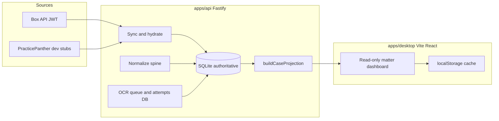

# WC Legal Prep — product overview and roadmap

Permanent project documentation: architecture, code map, test surface, milestones (M1–M3), phased delivery, and explicit non-goals. For Cursor plan tracking, see [`.cursor/plans/wc_legal_prep_roadmap.plan.md`](../.cursor/plans/wc_legal_prep_roadmap.plan.md).

---

## What this project is

**Purpose:** Support **workers’ comp hearing prep** (and related workflows) by turning external matter sources—primarily **Box** and (eventually) **PracticePanther**—into a structured **read model**: classified documents, a **canonical document/page spine**, **OCR/extraction state**, **issues / proof requirements**, and **branch workflow** status (e.g. medical-request branch stages).

**Architecture (current):**

**Shared contracts:** [`packages/domain-core/src/index.ts`](../packages/domain-core/src/index.ts) defines projection shapes, event names, and seed-oriented types. **Rules/calculators** live in [`packages/wc-rules`](../packages/wc-rules) and [`packages/wc-calculators`](../packages/wc-calculators).

### Key code map

| Area | Location | Role |
|------|----------|------|
| HTTP surface | [`apps/api/src/server.ts`](../apps/api/src/server.ts) | Health, dev case CRUD, Box JWT + folder list + recursive sync, file download, dev hydrates, classify/normalize, OCR queue/attempt APIs, projection |
| Orchestration | [`apps/api/src/runtime.ts`](../apps/api/src/runtime.ts) | Case scaffold, normalization, branch evaluation, OCR lifecycle (`recordCanonicalPageOcrAttempt`) |
| Read model | [`apps/api/src/projection.ts`](../apps/api/src/projection.ts) | Assembles `MatterProjection` |
| Box integration | [`apps/api/src/box-provider.ts`](../apps/api/src/box-provider.ts) | JWT client, folder listing, recursive inventory |
| Connector plumbing | [`source-adapters.ts`](../apps/api/src/source-adapters.ts), [`source-persistence.ts`](../apps/api/src/source-persistence.ts), [`sync-lifecycle.ts`](../apps/api/src/sync-lifecycle.ts) | Provider shaping, DB writes, sync runs/snapshots/errors |
| UI | [`apps/desktop/src/App.tsx`](../apps/desktop/src/App.tsx) | `GET /api/cases/:caseId/projection`, local cache; dogfood actions (M1): Sync + Normalize buttons |
| DB | [`schema.ts`](../apps/api/src/schema.ts), [`db.ts`](../apps/api/src/db.ts) | Migrations + startup compatibility guard |

**OCR nuance:** OCR is **modeled** in SQLite (`ocr_attempts`, page `ocr_status`, review queue, HTTP APIs), but **no in-repo worker** runs Tesseract/VLM yet. A worker will dequeue attempts, fetch bytes, rasterize, OCR, then `POST` results to the API.

---

## Test surface as a product asset

Vitest suite under [`apps/api/src/__tests__/`](../apps/api/src/__tests__/) covers sync lifecycle (success / partial / double failure), Box and PP hydrate, projection accuracy, migration compatibility, and Box provider (config, scope, entry mapping, recursive walk). Phases 2–4 can move quickly with regression protection on core contracts.

---

## Tier A vs Tier B

### Tier A — Internal dogfood

End-to-end as an **operator**: run API, create case (`POST /dev/cases`) with `box_root_folder_id`, Box JWT probe + `POST /api/connectors/box/sync`, `POST /dev/cases/:caseId/normalize-documents`, open desktop with `VITE_API_BASE_URL`, load projection. **M1** removes curl for sync + normalize from the desktop.

### Tier B — Lawyer-usable alpha

In-app document viewing, **running OCR**, API auth, hosted deployment, packaging beyond Vite dev—not there yet.

---

## M1 — Dogfood UI (~one focused session)

1. **Sync Box** — `POST /api/connectors/box/sync` with `{ case_id }` (case must have `box_root_folder_id`). Show `box_sync` + `inventory` in UI.
2. **Normalize documents** — `POST /dev/cases/:caseId/normalize-documents`. Show counts.
3. **Refresh projection** after success — reuse existing `refreshProjection()`.
4. **Runbook** — env ([`../.env.example`](../.env.example)), `npm run dev` / `npm run dev:desktop`, case setup, Sync → Normalize → verify.

---

## Phased plan (dependency order)

| Phase | Focus | Notes |
|-------|--------|------|
| **1** | Dogfood UX (M1) | Thin `fetch()` wiring; runbook |
| **2** | Rasterization spike | **Default:** `pdf-to-img` / `pdfjs-dist` **in-process** for M2; native binaries + out-of-process later (Phase 5) |
| **3** | OCR worker | Add **`resolvePageAssetContext(db, canonicalPageId)`** (canonical_page → canonical_document → logical_document → source_item); dequeue, download, rasterize, Tesseract, `POST` ocr-attempts |
| **4** | Extraction MVP | Append-only extractions; **no** side effects inside OCR completion beyond text |
| **5** | Hosted hardening | **SQLite + WAL** on persistent volume default for single-tenant; Postgres only if multi-tenant / scale; auth, CORS, observability |
| **6** | PracticePanther | Real OAuth sync after Box vertical is stable |
| **7** | Lawyer features | PDF preview, exhibits, artifacts |

---

## Milestones

- **M1:** Desktop Sync + Normalize + auto projection refresh; no curl on happy path.
- **M2:** Real Box PDF → non-empty `raw_text` on a canonical page in projection.
- **M3:** Authenticated API + one deployment story + desktop → prod; SQLite on disk unless multi-tenant needs Postgres.

---

## What not to do yet

- **Incremental Box delta sync** until full-folder sync + cursors are proven at scale.
- **Extraction side effects inside OCR completion** — keep retries and audits sane.

---

## Repo layout (monorepo)

- `apps/api` — Fastify + SQLite authoritative store  
- `apps/desktop` — React/Vite shell  
- `packages/domain-core` — shared projection/types  
- `packages/wc-rules`, `packages/wc-calculators` — rules and calculators for future product logic  
